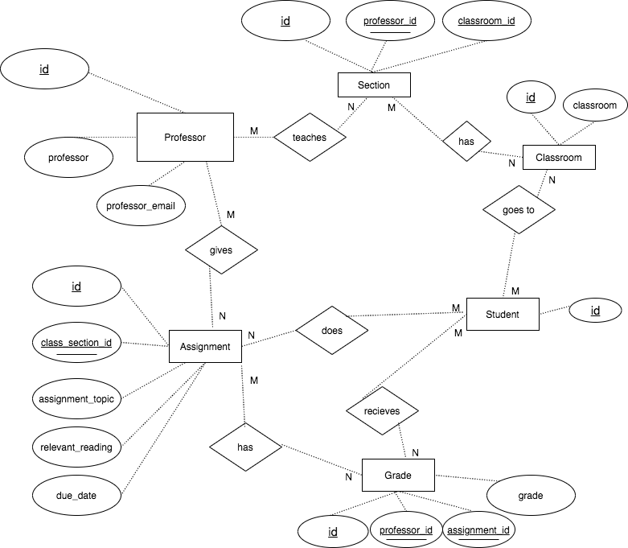

# Data Normalization and Entity-Relationship Diagramming Report

## Table containing the original dataset
| assignment_id | student_id | due_date | professor | assignment_topic                | classroom | grade | relevant_reading    | professor_email  |
| :------------ | :--------- | :------- | :-------- | :------------------------------ | :-------- | :---- | :------------------ | :--------------- |
| 1             | 1          | 23.02.18 | Bloomberg | Data normalization              | WWH 101   | 80    | Deumlich Chapter 3  | bloo@foo.edu     |
| 2             | 1          | 18.11.18 | Engel     | Single table queries            | 60FA 314  | 25    | Dümmlers Chapter 11 | d.e.1234@foo.edu |
| 1             | 4          | 23.02.18 | Bloomberg | Data normalization              | WWH 101   | 75    | Deumlich Chapter 3  | bloo@foo.edu     |
| 5             | 2          | 05.05.18 | Engel     | Python and pandas               | 60FA 314  | 92    | Dümmlers Chapter 14 | d.e.1234@foo.edu |
| 4             | 2          | 04.07.18 | Clayton   | Spreadsheet aggregate functions | WWH 201   | 65    | Zehnder Page 87     | j.c.3@foo.edu    |
| ...           | ...        | ...      | ...       | ...                             | ...       | ...   | ...                 | ...              |

## What makes this dataset not compliant with 4NF
In order for this dataset to be in 4NF, it must also be in 1NF, 2NF, and 3NF. Instead of finding a candidate key for the table above I instead added an id column to the original table. Now, even though the table was in 1NF(all records have the same number of fields, and there is only one value per field) and 2NF (since table does not have a composite key, 2NF does not apply), it did not satisfy 3NF.
3NF is violated when a non-key field is a fact about another non-key field. From the table we see that a non-key field `professor_email` provides a fact about another non-key field `professor`. `assignment_topic` provides information about "assignment_id". `relevant_reading` provides information about `assignment`. There are several instances of non-key attributes being facts about other non-key attributes. This means that the dataset is not compliant with 3NF and hence not compliant with 4NF either.

## Converting to 4NF

### Making this dataset compliant with 3NF
To make the tables 3NF compliant we must ensure that each non-key field in a table must provide a fact about the entity uniquely identified by the primary key, and that no non-key field contains fact about another non-key field. We must then break originial table into more tables.

`grades` table:

id| student_id | assignment_id | grade
--| -----------| ------------- | -----
1 |1  | 1             | 80
2 | 1  | 2             | 25
3 |4  | 1             | 75
4 |2  | 5             | 92
5  | 2 |  4             | 65
... | ... | ... | ...

 `assignment_id` is a foreign key which refers primary key `id` of the `assignments` table shown below, and `student_id` is another foreign key that refers to the primary key `id` in the `students` table. `grades` table is in 3NF because non-key field `grade` provides a fact about the grade entity uniquely identified by the primary key `id`. As do `student_id` and `assignment_id`.

`assignments` table:
id | class_section_id | assignment_topic | relevant_reading | due_date
-- | ------------ | ---------------- | ---------------- | --------
1 | 1 | Data normalization | Deumlich Chapter 3 | 23.02.18
2 | 2 | Single table queries | Dümmlers Chapter 11 | 18.11.18
3 | 4 | Entity-Relationship Diagrams | Dümmlers Chapter 15 | 03.24.18
4 | 3 | Spreadsheet aggregate functions | Zehnder Page 87 | 04.07.18
5 | 2 | Python and pandas | Dümmlers Chapter 14 | 05.05.18
... | ... | ... | ... | ...

The primary key for `assignments` table is `id` and the foreign key for this table is
`class_section_id`, which refers to the primary key `id` in the `class_section` table shown below. `assignments` table is in 3NF because all non-key fields: `assignment_topic`, `relevant_reading`, and `due_date` are facts about the assignment entity uniquely identified by the primary key `id`.

`class_section` table:
id | professor_id | classroom_id
-- | ------------ | ------------
1 | 1 | 1
2 | 2 | 2
3 | 3 | 3
4 | 1 | 2
5 | 2 | 1
... | ... | ...

The primary key for `class_section` table is `id`. `professor_id` is a foreign key referring to the primary key `id` in the `professors` table. `classroom_id` is another foreign key that refers to the primary key `id` in the `classrooms` table. `class_section` is in 3NF becuase all non-key fields: `professor_id` and `classroom_id` are facts about the assignment entity uniquely identified by the primary key `id`.

 `professors` table:
id | professor | professor_email
-- | --------- | --------------- 
1 | Bloomberg | bloo@foo.edu 
2 | Engel | d.e.1234@foo.edu 	
3 | Clayton | j.c.3@foo.edu 
... | ... | ... 

The primary key for `professors` table is `id`. This table satisfies 3NF because all non-key fields provide a fact about the professor entity uniquely identified by the primary key `id`.

 `classrooms` table:
id | classroom
-- | ---------
1 | WWH 101
2 | 60FA 314	
3 | WWH 201
... | ...

The `id` field for `classrooms` table is the primary key and represents a classroom. This table satisfies 3NF because there is no non-key field providing fact about another non-key field, and it also satisfies first and second normal form.  

`students` table:
id | 
-- | 
1 | 
2 | 
3 | 
4 | 
5 | 
... | ... | ...

The `id` field for `students` table is the primary key 

After checking the new tables we find that none of these tables has more than one multi-valued fact attribute and hence the tables are also 4NF compliant.

## ER diagram 

